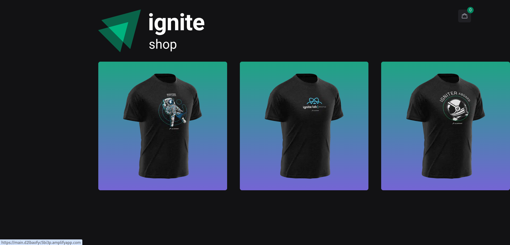
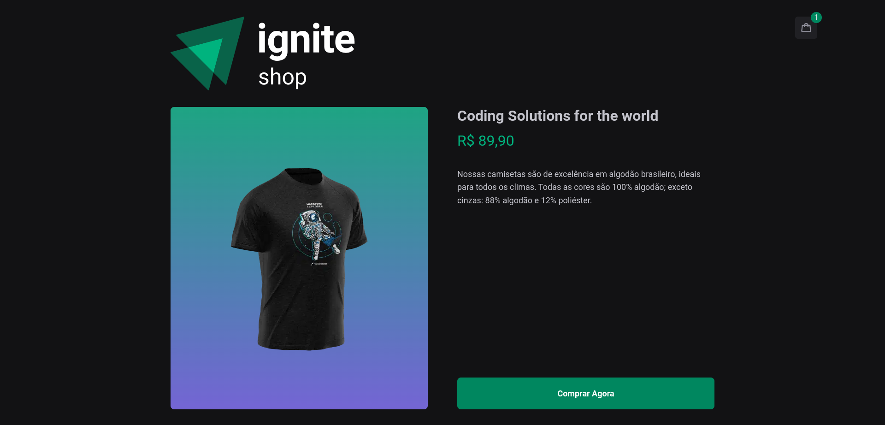
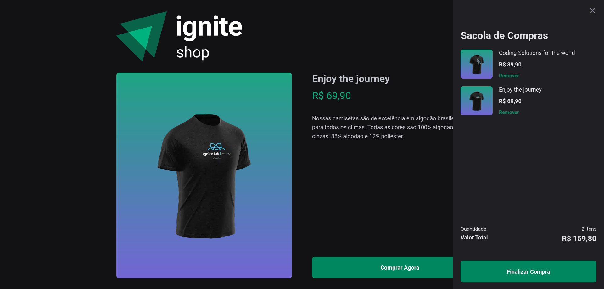
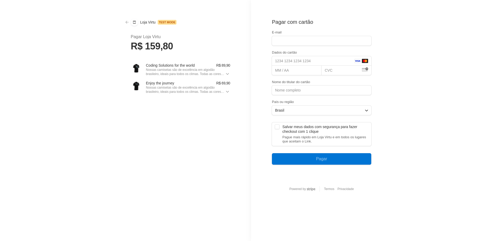

# Descrição do Projeto.

Projeto desenvolvido durante a formação React da Rocketseat.

Durante a aula foi desenvolvido um projeto que cria o front-end de uma loja virtual e usa o Stripe ([saber mais](https://stripe.com/br)) como backend para buscar os produtos e para fazer checkout.

O desafio que foi realizado por mim nesse projeto, foi criar um carrinho para permitir faturar mais que um produto, aproveitei também e refatorei o código para usar o APP Router ao invés de Page Routes.

# Imagens do Projeto

**Home**

**Pagina do Produto**

**Carrinho**

**Integração com o checkout do Stripe**

